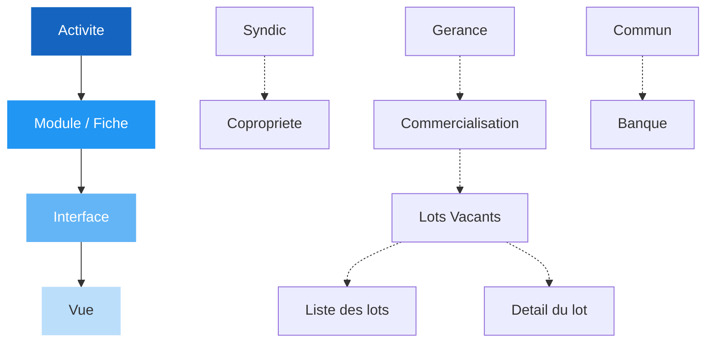
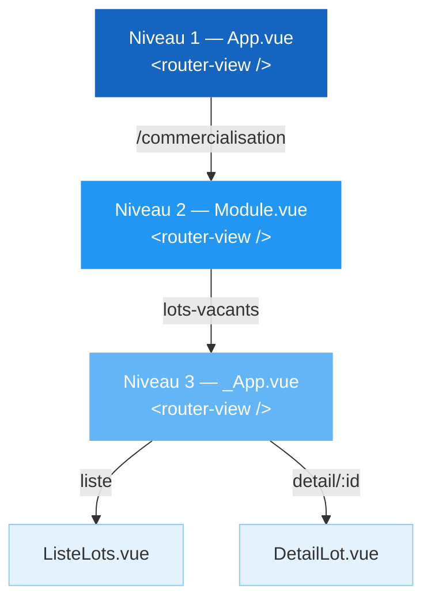

# Architecture Full Web

> Ce document a pour objectif de decrire la nouvelle architecture Full Web de l'application Lojii.

| | |
|---|---|
| **Auteur** | Denis THEVENOT |
| **Cree le** | 22 / 03 / 2024 |
| **Modifie le** | 30 / 10 / 2025 |

---

## Sommaire

- [1. Presentation](#1-presentation)
  - [1.1. Technos embarquees](#11-technos-embarquees)
  - [1.2. WebApp (client leger)](#12-webapp-client-leger)
  - [1.3. Nomenclature hierarchique](#13-nomenclature-hierarchique)
  - [1.4. Roadmap](#14-roadmap)
- [2. Description IHM](#2-description-ihm)
  - [2.1. Schema des blocs](#21-schema-des-blocs)
  - [2.2. Apercu de l'application](#22-apercu-de-lapplication)
- [3. Arborescence](#3-arborescence)
  - [3.1. Le dossier Public](#31-le-dossier-public)
  - [3.2. Les Assets](#32-les-assets)
  - [3.3. Les Plugins](#33-les-plugins)
  - [3.4. Les Vues](#34-les-vues)
  - [3.5. Les Composants](#35-les-composants)
  - [3.6. Les Composables](#36-les-composables)
  - [3.7. La Bibliotheque de Composants](#37-la-bibliotheque-de-composants)
- [4. Plugins & Outils globaux](#4-plugins--outils-globaux)
  - [4.1. Le Routage](#41-le-routage)
  - [4.2. Le Store](#42-le-store)
  - [4.3. Les Evenements](#43-les-evenements)
  - [4.4. Les Fonctions outils](#44-les-fonctions-outils)
  - [4.5. Les Filtres](#45-les-filtres)
  - [4.6. Les Requetes back](#46-les-requetes-back)
  - [4.7. Le Gestionnaire des menus](#47-le-gestionnaire-des-menus)
  - [4.8. La nomenclature](#48-la-nomenclature)

---

## 1. Presentation

Ceci est une presentation technique de la nouvelle application Lojii.

La motivation qui a conduit au lancement de ce projet, est la volonte de se debarrasser du langage/framework WinDev qui nous a pose de nombreux problemes par le passe.

### 1.1. Technos embarquees

L'application sera developpee sur la base du framework **Vue.js 3.x**, avec comme framework graphique supplementaire **Vuetify 3.x**.

### 1.2. WebApp (client leger)

L'application sera 100% en web, aucune installation d'executable est necessaire, l'utilisateur doit juste acceder au portail de connexion depuis son navigateur (Chrome de preference).

Une fois connecte (via Google Authentification), l'utilisateur peut, s'il le souhaite, l'installer en mode WebApp via l'icone dans la barre d'URL de son navigateur.

Lorsqu'une popup Windows propose d'installer Lojii comme application, l'utilisateur peut accepter pour avoir l'icone sur le bureau et dans sa barre des taches.

<div style="background-color:#FFEBEE; border-left:4px solid #F44336; padding:12px 16px; margin:12px 0; border-radius:4px; color:#C62828; font-style:italic; font-size: 12px;">
<strong>⚠ Important</strong><br>
Vous devez avoir vos certificats locaux valides pour que le mode PWA (webApp) fonctionne en mode developpement local. Voir la doc ici : TRUCS & ASTUCES - Certificats HTTPS valides
</div>

### 1.3. Nomenclature hierarchique

Voici un schema des differents niveaux hierarchiques :



### 1.4. Roadmap

Le deroule de la migration de la version WinDev a la version full web se fera en suivant ces etapes :

- [x] POC sur l'architecture la plus adaptee : projet global unique
- [x] Creation de la premiere version en VueJS2/Vuetify2
- [x] Creation de la structure globale : barre de titre, onglets, menu, sous-menu, ...
- [x] Ajout des premiers ecrans (vues/composants) web
- [x] Upgrade de l'architecture en version Vue3(Vite)/Vuetify3
- [x] Migration des vues et composants en Vuetify3
- [x] Integration et migration de la bibliotheque de composants en Vuetify3 et dans le projet
- [ ] Migration des derniers ecrans WinDev en Web
- [ ] Implementation des iframes dans certaines parties de l'application pour appeler les projets isoles (encore en Vue2) et non migre dans l'application
- [ ] Derniers controles avant officiellement desactiver Lojii WD et lancer Lojii FW
- [ ] Migration des derniers projets Vue2 isoles dans l'application en Vue3

---

## 2. Description IHM

L'application est concue pour s'afficher sur un ecran ayant une resolution de **1920x1080** (Full HD), donc avec un ecran de minimum 22" pour un confort optimal. Voici la description detaillee des 4 blocs principaux qui la composent :

- **le menu principal (MainMenu)**
  - toujours visible
  - 60px de large sur toute la hauteur disponible de la fenetre
  - Elle s'agrandit au clic sur le logo de l'App (Lojii) pour faire apparaitre le libelle des icones
- **la barre d'onglets de navigation (BarOnglets)**
  - Visible uniquement en mode WebApp et quand l'utilisateur a ouvert au moins 1 ecran en mode onglet (ctrl+clic)
  - 40px de haut sur toute la largeur de la fenetre (sans la barre de menu principal)
- **La barre de titre (BarTitre)**
  - toujours visible
  - 50px de haut sur toute la largeur (sans la barre de menu principal)
  - Elle contient :
    - le bouton de retour arriere dans l'historique
    - l'icone du module/fiche (qui permet au survol de refermer le menu module/fiche)
    - le titre du module/fiche
    - le bouton liste des roles (uniquement en mode Fiche)
    - la barre de recherche globale
    - l'icone des notifications
    - le bouton du panneau utilisateur
- **l'ecran du Module/Fiche**
  - il contient lui-meme 2 sous-blocs :
    - **son menu**
      - present uniquement si un menu existe pour le module ou la fiche
      - escamotable via le burger menu de l'icone de la barre de titre
      - actuellement sa largeur est fixee a 300px sur 956 (sans onglets) ou 916 (avec onglets) de haut
    - **l'ecran principal(1) du module ou de la fiche** qui affiche le contenu de la vue appelee via son menu
      - toujours visible
      - meme hauteur dynamique que son menu, et largeur de 1570 au plus petit (avec son menu ouvert), et 1870 au plus grand (sans son menu)

*(1) l'ecran principal du module ou de la fiche est proportionnel a la hauteur de l'ecran, car calcule en tenant compte de la barre d'onglet (visible ou pas), et de la barre de titre, et idem pour la largeur. Donc si vous gerez correctement vos scrolls a l'interieur de vos projets front, ils s'adapteront parfaitement.*

### 2.1. Schema des blocs

Ce schema est base sur une resolution standard de 1920x1080.

<div style="display:grid; grid-template-columns:25px 1fr; grid-template-rows:1fr; width:800px; height:450px; border:2px solid #333; font-family:sans-serif; font-size:12px; overflow:hidden;">
  <!-- MainMenu -->
  <div style="background:#1565C0; color:#fff; display:flex; align-items:center; justify-content:center; writing-mode:vertical-lr; text-orientation:mixed; font-weight:bold; font-size:11px; border-right:1px solid #333;">
    MainMenu — 60px
  </div>
  <!-- Zone droite -->
  <div style="display:grid; grid-template-rows:17px 21px 1fr;">
    <!-- BarOnglets -->
    <div style="background:#FF8F00; color:#fff; display:flex; align-items:center; justify-content:center; font-weight:bold; font-size:10px; border-bottom:1px solid #333;">
      BarOnglets — 40px (visible en mode WebApp + onglet ouvert)
    </div>
    <!-- BarTitre -->
    <div style="background:#2E7D32; color:#fff; display:flex; align-items:center; justify-content:center; font-weight:bold; font-size:10px; border-bottom:1px solid #333;">
      BarTitre — 50px &nbsp;|&nbsp; retour &nbsp;|&nbsp; icone &nbsp;|&nbsp; titre &nbsp;|&nbsp; roles &nbsp;|&nbsp; recherche &nbsp;|&nbsp; notifs &nbsp;|&nbsp; user
    </div>
    <!-- Contenu -->
    <div style="display:grid; grid-template-columns:125px 1fr;">
      <!-- Menu Module -->
      <div style="background:#7B1FA2; color:#fff; display:flex; align-items:center; justify-content:center; text-align:center; font-weight:bold; border-right:1px solid #333; padding:4px;">
        Menu<br>Module/Fiche<br><span style="font-weight:normal; font-size:10px;">300px</span>
      </div>
      <!-- Ecran Principal -->
      <div style="background:#E3F2FD; color:#333; display:flex; align-items:center; justify-content:center; text-align:center; padding:8px;">
        <div>
          <strong>Ecran Principal</strong><br>
          du Module / de la Fiche<br>
          <span style="font-size:10px; color:#666;">1570px (avec menu) → 1870px (sans menu)</span>
        </div>
      </div>
    </div>
  </div>
</div>

<sub><em>Proportions respectees sur base 1920×1080 (echelle ~42%)</em></sub>

### 2.2. Apercu de l'application

*(cf. capture d'ecran dans le document PDF original)*

---

## 3. Arborescence

<pre>
📁 public/
  📁 config/📄 env.json
  📁 img/📁 icons/...                  ← Toutes les icones du manifest (WebApp)
  📁 js/
    📁 tinymce/                        ← Librairie de TinyMCE 6
    📄 auth.js                         ← Utilitaire interne d'authentification (Google)
  📄 favicon.ico                       ← Favicon de l'application (logo Lojii)
  📄 manifest.json                     ← Infos pour le mode WebApp
  📄 robots.txt                        ← Regles pour les robots des moteurs de recherche (tout interdit !)
📁 src/
  📁 assets/
    📁 images/                         ← Contient l'ensemble des images utilisees dans l'application
    📁 scss/                           ← Contient les regles (S)CSS globales de l'application
      📄 _&lt;nom_categorie&gt;.scss         ← Fichiers contenant l'ensemble des regles d'une categorie
      📄 main.scss                     ← Fichier principal importe dans Vue, qui appelle tous les autres fichiers
  📁 bibliotheque/                     ← Tous les composants de la bibliotheque en version Vue3/Vuetify3
  📁 components/
    📁 _common/                        ← Dossier contenant tous les composants communs a l'application*
       ConfirmBox.vue
       ModuleMenu.vue                ← Menu des modules/fiches
    📁 &lt;NomModule&gt;/                    ← Chaque modules/fiches aura son propre dossier
      📁 &lt;NomInterface&gt;/               ← Toutes les "entrees" presentes dans le menu modules/fiches
        📁 &lt;NomVue&gt;/                   ← Contient tous les composants d'une des vues de l'interface
           &lt;NomComposantVue&gt;.vue     ← Tous les composants de la vue
         &lt;NomComposantCommun&gt;.vue    ← Tous les composants communs de l'interface
     &lt;NomComposantApp&gt;.vue           ← Tous les composants communs presents dans App.vue
  📁 composables/                      (Meme logique que les components)
    📁 _common/                        ← Dossier contenant tous les composables communs a l'application*
      📄 utils.js                      ← Composable contenant des differents outils generiques (format, convert, ...)
    📁 &lt;NomModule&gt;/                    ← Chaque modules/fiches aura son propre dossier
      📁 &lt;NomInterface&gt;/               ← Toutes les "entrees" presentes dans le menu modules/fiches
        📁 &lt;NomVue&gt;/                   ← Contient tous les composables d'une des vues de l'interface
          📄 &lt;nom-composable&gt;.js       ← Tous les composables de la vue
        📄 &lt;nom-composable-commun&gt;.js  ← Tous les composables communs de l'interface
  📁 plugins/
    📄 eventBus.js                     ← Gestionnaire d'evenements
    📄 filters.js                      ← Filtres generiques
    📄 menus.js                        ← Gestions des menus/arborescence de l'application
    📄 neoteem.js                      ← Gestion des requetes Back (WS/Go)
    📄 store.js                        ← Gestion du store global
    📄 utils.js                        ← Gestion des fonctions utilitaires
  📁 router/                           ← Contient l'ensemble des routes
    📄 index.js                        ← declaration globale du router
    📄 main.js                         ← routes principales
    📄 commercialisation.js            ← routes du module Commercialisation
    📄 ...
  📁 store/                            ← Contient l'ensemble des stores Pinia
    📄 index.js                        ← declaration globale du store
    📄 main.js                         ← store principal
    📄 menus.js                        ← store de la gestion des menus
    📄 ...
  📁 views/
    📁 &lt;NomModule&gt;/                    ← Dossier de chaque modules/fiches
      📁 &lt;NomInterface&gt;/               ← Dossier des interfaces
         _App.vue                    ← Vue principale de l'interface (3eme et dernier niveau du router-view)
         &lt;NomVueInterface&gt;.vue       ← Toutes les vues de l'interface
       &lt;NomVueInterface&gt;.vue         ← Toutes les interfaces a vue unique
     Home.vue                        ← Page d'accueil de l'App
     Module.vue                      ← Vue principale du module/fiche (2eme niveau du router-view)
   App.vue                           ← Vue principale de l'App (1er niveau du router-view)
  📄 ...                               ← Tous les fichiers habituels a la racine
📄 index.html                          ← Index HTML de l'application
</pre>

### 3.1. Le dossier Public

Le dossier `/public/` contient globalement les sous-dossiers et fichiers habituels d'un projet Vue.js, a ceci pres qu'il embarque directement le fichier d'authentification `auth.js`, etant donne qu'il sera au final quasi le seul projet Front a l'utiliser.

Il embarque egalement la librairie de **TinyMCE v6**. Le fait d'auto-heberger de maniere centralisee la librairie de TinyMCE permet d'une part de beneficier de la version totalement gratuite (celle hebergee par le cloud necessite une cle de licence), et d'etre sur d'utiliser la meme version partout dans l'application.

### 3.2. Les Assets

Le dossier des `/assets/`, contient le sous-dossier des images, qui, comme son nom l'indique, embarque toutes les images utilisees dans l'application, et un autre sous-dossier `/scss/` qui contient l'ensemble de la libraire des regles globales de CSS de l'application.

Ce dernier contient le fichier principal `main.scss` qui fusionne l'ensemble des sous-fichiers de regles CSS decoupees par categorie. Il est importe dans toute l'application via cette ligne presente dans le `main.js` :

```js
// main.js
import './assets/scss/main.scss'
```

Les sous-fichiers sont systematiquement prefixes par des underscore (`_`) et sont decoupes par categorie (`_form.scss`, `_buttons.scss`, `_global.scss`, ...).

Lorsqu'on ajoute un nouveau fichier, donc une nouvelle categorie, par exemple `_transitions.scss` pour ecrire toutes les regles CSS liees aux transitions, il faut l'importer dans le `main.scss` :

```scss
// main.scss
@charset "UTF-8";

@import "variables";
@import "transitions"; // <- ici, pas besoin de preciser le prefixe, ni l'extension
@import "global";
```

Petite particularite pour le fichier `_variables.scss` qui contient toutes les declarations des variables globales SCSS utilisees dans l'application.

Il est a la fois importe dans le `main.scss`, pour pouvoir etre utilise dans les autres categories, mais egalement dans l'instance de Vue afin que les variables puissent etre utilisees dans tous les blocs `<style>` des vues et/ou composants.

Son instanciation est faite dans le `vite.config.mjs` :

```js
// vite.config.mjs
export default defineConfig({
  // ...
  css: {
    preprocessorOptions: {
      scss: {
        additionalData: `@use "@/assets/scss/variables" as *;`,
      },
      sass: {
        api: 'modern-compiler',
      },
    },
  },
  // ...
})
```

### 3.3. Les Plugins

Le dossier `/plugins/` contiendra tous les fichiers javascript globaux comme la librairie d'outils, des filtres, etc, a l'exception du routeur et du store qui eux seront subdivises en plusieurs sous-fichiers dans leur dossier respectif.

Cela permet de tout centraliser en un seul dossier, plutot que de multiplier les dossiers du type `/common/`, `/includes/`, `/utils/`, `/filters/`, ...

Seul le fichier `main.js` doit rester a la racine car c'est le point d'entree de toute l'application, et le `registerServiceWorker.js` car il est utilise implicitement par Vue/Vite.

### 3.4. Les Vues

Le dossier `/views/` contiendra en premier niveau, tous les dossiers des modules ou fiches de l'application, qui eux-memes contiendront les sous-dossiers des interfaces, et ainsi de suite. Le seul et unique fichier qu'il contient a sa racine, est `Home.vue` qui correspond a la page d'accueil de l'application (le Tableau de bord des Widgets), une fois connecte.

Les 3 activites que sont le "Syndic", la "Gerance" et le "Commun", ne seront representees ni dans le dossier `/views/`, ni dans le dossier `/components/`, le premier niveau de dossiers represente directement les modules/fiches eux-memes.

Donc, chaque dossier du premier niveau represente un module ou une fiche. Par exemple pour le module "Commercialisation" du groupe "Gerance", on trouvera dans le dossier `/views/` l'arborescence suivante :

<pre>
📁 views/
  📁 Commercialisation/
     Commercialisation.vue
</pre>

<div style="background-color:#FFEBEE; border-left:4px solid #F44336; padding:12px 16px; margin:12px 0; border-radius:4px; color:#C62828; font-style:italic; font-size: 12px;">
<strong>⚠ Important</strong><br>
Que ce soit les noms de dossiers ou de fichiers, ils doivent tous respecter la regle du <strong>PascalCase</strong>.
</div>

A l'interieur du dossier du module ou de la fiche, on trouvera les sous-dossiers pour chaque interface, lesquels correspondent a une entree dans le menu du module/fiche. Toujours pour le module "Commercialisation", on aura par exemple les Lots-Vacants avec son dossier et son point d'entree portant le meme nom :

<pre>
📁 views/
  📁 Commercialisation/
    📁 LotsVacants/
       LotsVacants.vue
     Commercialisation.vue
</pre>

Il contiendra aussi toutes ses vues :

<pre>
📁 views/
  📁 Commercialisation/
    📁 LotsVacants/
       DetailLot.vue
       LotsVacants.vue
       ListeLots.vue
      ...
     Commercialisation.vue
</pre>

Et ainsi de suite pour toute l'arborescence de l'application.

### 3.5. Les Composants

Les composants reprennent globalement la meme logique que les vues, a ceci pres qu'ils peuvent avoir des niveaux supplementaires d'arborescence pour des parties et sous-parties de leurs vues.

Si on reprend l'exemple de l'interface des "Lots-Vacants", qui appartient au module "Commercialisation", qui lui-meme appartient a l'activite "Gerance", on aura cette arborescence :

<pre>
📁 components/
  📁 Commercialisation/
    📁 LotsVacants/
      📁 DetailLot/                       ← Dossier pour une des vues decoupee en plusieurs composants
         InfosPrincipales.vue
        ...
       InfosProspect.vue                ← Composant commun a toute l'interface ou generique
      ...
     TableauBord.vue                    ← Composant commun a tout le module/fiche
</pre>

Petite differenciation entre les composants du dossier `/_common/` et ceux a la racine : le premier contient tous les composants communs a l'ensemble des vues et autres composants de l'application (`DiagConfirme.vue`, `ModuleMenu.vue`, ...), tandis que ceux a la racine correspondent aux composants appeles uniquement dans la vue principale `App.vue` (ex. `Message.vue`, `BarTitre.vue`, ...).

Le dossier `/_common/` sera donc alimente au fur et a mesure des besoins. Il pourra aussi contenir des sous-dossiers dans le cas d'un composant commun qui serait eclate en plusieurs sous-composants, mais ne lui appartenant qu'a lui. Par exemple :

<pre>
📁 components/
  📁 _common/
     ConfirmBox.vue
    📁 MonComposantParent/                ← Le dossier porte le meme nom que le composant parent
       MonComposantParent.vue           ← Composant Parent
       MonComposantEnfant1.vue          ← Composant enfant 1 du Parent
       MonComposantEnfant2.vue          ← Composant enfant 2 du Parent
      ...
</pre>

### 3.6. Les Composables

Les composables reprennent exactement le meme fonctionnement que celui des composants. Pour choisir a quel niveau d'arborescence on place un composable, ce sera en fonction du groupe de composants/vues plus ou moins cible qui l'utilise.

Ceux places dans le sous-dossier `/_common/` seront utilises de maniere transverse par toute l'application.

<div style="background-color:#FFEBEE; border-left:4px solid #F44336; padding:12px 16px; margin:12px 0; border-radius:4px; color:#C62828; font-style:italic; font-size: 12px;">
<strong>⚠ Important</strong><br>
Par convention les composables seront nommes en <strong>kebab-case</strong>.
</div>

### 3.7. La Bibliotheque de Composants

La bibliotheque de composants sera directement integree dans le projet Lojii Full Web, et migree en Vue3/Vuetify3 pour une maintenabilite plus simple. A terme la version isolee actuelle en Vue2/Vuetify2 sera supprimee, ou pourra etre remplacee par celle de Lojii dans une autre version (toujours isolee) pour des projets autres que Lojii (Extranet, ...).

Son dossier se trouvera a la racine de `/src/` :

<pre>
📁 _bibliotheque/
</pre>

---

## 4. Plugins & Outils globaux

L'application embarque un certain nombre d'outils et de plugins, qui sont essentiellement situes pour certains dans le dossier `/plugins/` et pour d'autres dans leur propre dossier. Nous allons les passer en revue, et decrire leur fonctionnement.

### 4.1. Le Routage

La declaration des routes sont regroupees par thematique dans le dossier `/router/...`, et sont organisees en arborescence via la propriete `children` (type Array) de Vue-Router.

Le principe est qu'une route enfant herite automatiquement (en prefixe) de la route parente. Donc pas besoin de la repeter systematiquement. Seuls les chemins des fichiers des vues doivent etre complets.

<div style="background-color:#E3F2FD; border-left:4px solid #1565C0; padding:12px 16px; margin:12px 0; border-radius:4px; color:#0D47A1; font-style:italic; font-size: 12px;">
<strong>ℹ Info</strong><br>
A terme on rendra dynamique la construction des routes via le fichier <code>/plugins/menus.js</code> lequel contient deja la structure en arborescence. Cela evitera de maintenir deux fichiers en meme temps lors d'ajout de nouvelles vues/routes.
</div>

Cette structure implique qu'il y a **3 niveaux de routage** :

1. le routage principal (appelle le module ou la fiche)
2. le routage dans chaque module/fiche (appelle l'interface)
3. le routage dans chaque interface (appelle l'une des vues de l'interface)

Pour information, il existe deux grands types de routes principales : les **modules** (ex. "Commercialisation") et les **fiches** (ex. "Coproprietaire"). Viennent ensuite en deuxieme niveau, les **interfaces** (ex. "Lots-Vacants"). Enfin le 3eme niveau correspond aux differentes vues des interfaces.



#### Niveau 1 - App.vue

Le premier niveau de routage correspond au module/fiche dans le `App.vue` :

```vue
<!-- App.vue -->
<template>
    <v-app>
        <Chargement v-if="$store.loading" />
        <v-container v-else>
            <section class="app">
                <router-view /> <!-- ici la route du module ou de la fiche -->
            </section>
        </v-container>
    </v-app>
</template>
```

#### Niveau 2 - Module.vue

Le deuxieme niveau de routage correspond a l'interface, et est present dans le fichier `Module.vue` :

```vue
<!-- Module.vue -->
<template>
    <div class="module">
        <ModuleMenu /> <!-- menu du module/fiche -->
        <v-main>
            <router-view /> <!-- ici la route de l'interface -->
        </v-main>
    </div>
</template>
```

#### Niveau 3 - _App.vue de l'interface

Enfin, le troisieme niveau de routage correspond a la vue appelee de l'interface, et se situe dans le fichier de point d'entree de son interface nomme `_App.vue`, par exemple : `/views/Commercialisation/LotsVacants/_App.vue`.

```vue
<!-- <NomSousModule>.vue -->
<template>
    <div class="lots-vacants">
        <router-view /> <!-- ici la route de la vue appelee de l'interface -->
    </div>
</template>
```

#### Structure du routeur

Voici a quoi ressemble le routeur :

```js
// router.js
import Vue from 'vue'
import VueRouter from 'vue-router'

Vue.use(VueRouter)

export default new VueRouter({
  routes: [
    {
      path: '/',
      component: () => import('@/views/Home.vue')
    },
    // ...
    {
      path: '/commercialisation',
      component: () => import('@/views/Commercialisation/Commercialisation.vue'),
      children: [
        {
          path: '',
          component: () => import('@/views/Commercialisation/TableauBord.vue')
        },
        // ...
        {
          path: 'lots-vacants',
          component: () => import('@/views/.../LotsVacants/LotsVacants.vue'),
          children: [
            {
              path: 'liste',
              name: 'liste',
              component: () => import('@/views/.../LotsVacants/ListeLots.vue'),
            },
            // ...
          ]
        },
        // ...
      ]
    },
    // ...
  ]
})
```

<div style="background-color:#FFEBEE; border-left:4px solid #F44336; padding:12px 16px; margin:12px 0; border-radius:4px; color:#C62828; font-style:italic; font-size: 12px;">
<strong>⚠ Important</strong><br>
Seuls les <code>path</code> des routes de premier niveau contiennent un slash <code>/</code> en debut de chaine !
</div>

#### Utilisation dans les composants

Lorsque vous avez besoin d'acceder a la route et/ou au routeur dans l'un de vos fichiers `.vue`, vous devez proceder comme suit :

```vue
<template>
    <div>
        <v-btn icon="mdi-home" @click="$router.push({ path: '/' })" />
    </div>
</template>

<script setup>
import { useRoute, useRouter } from 'vue-router'
const $router = useRouter()
const $route = useRoute()

const loadDatas = () => {
    neoteem.query(`load/datas${$route.params.id}`).then(response => {
        datas.value = response
    })
}
</script>
```

<div style="background-color:#FFEBEE; border-left:4px solid #F44336; padding:12px 16px; margin:12px 0; border-radius:4px; color:#C62828; font-style:italic; font-size: 12px;">
<strong>⚠ Important</strong><br>
Par convention, la route et le routeur etant des elements globaux de l'instance Vue, ils seront prefixes avec le caractere dollar (<code>$route</code> et <code>$router</code>), afin de les distinguer de toutes autres variables ou constantes locales.
</div>

#### Changement de route

Pour des raisons techniques de gestion des menus et de suivi de navigation, tous les changements de route ne se feront pas de la maniere habituelle :

```js
// methode classique
$router.push({ path: '/commercialisation/ma-vue' })

// nouvelle methode pour Lojii
$eventBus.$emit('change-route', '/commercialisation/ma-vue')
```

#### Masquer l'interface dans l'app WinDev

Dans le cadre de l'appel d'un ecran de Lojii Full Web dans l'app WinDev, il est necessaire de masquer une partie de l'interface pour ne pas parasiter celle de l'app par defaut. Vous avez la possibilite de masquer l'interface globale (menu principal, barre d'onglets, barre de titre), et le menu du module. Pour cela vous avez deux proprietes meta `hideAll` et `hideMenu` a ajouter dans votre route de la maniere suivante :

```js
// mon-routeur.js
{
    path: 'ma-route',
    component: MaVue,
    meta: { hideMenu: true, hideIhm: true },
    children: [],
},
```

Dans cet exemple, toutes les routes, meme enfants auront la structure principale et le menu du module masques.

<div style="background-color:#E3F2FD; border-left:4px solid #1565C0; padding:12px 16px; margin:12px 0; border-radius:4px; color:#0D47A1; font-style:italic; font-size: 12px;">
<strong>ℹ Info</strong><br>
Ces meta parametres ne sont pris en compte que dans un Chromium (embarque dans l'App WD), donc si vous voulez voir leur effet, vous devez ouvrir votre ecran dans un Chromium, et non dans votre Chrome habituel.
</div>

### 4.2. Le Store

Pour des raisons de simplicite d'implementation et un souci d'organisation par thematique, nous partirons sur la bibliotheque **Pinia**.

Le store sera decoupe en plusieurs fichiers dans le dossier `/store/`, et chaque fichier correspondra a un sujet ou une thematique (ex. : `lots-vacants.js`, `user.js`, `theme.js`, ...).

Un store peut a la fois contenir des proprietes, mais egalement des methodes lesquelles peuvent modifier l'etat de ces proprietes. Il se comporte donc un peu comme une classe en POO.

Le store principal, qui contiendra les etats de l'application globale (`loading`, `message`, ...), se nomme `/store/main.js`, et sera probablement appele dans quasi toutes les vues ou composants.

#### Implementation d'un store

```js
// /store/menu.js
import { defineStore, acceptHMRUpdate } from 'pinia'
import Menus from '@/plugins/menus.js'
import { ref } from 'vue'

export const useMenu = defineStore('menu', () => {
    const items = ref(Menus)
    const pined = ref(true)

    const toggle = () => {
        pined.value = !pined.value
    }

    return {
        items,
        pined,
        toggle
    }
}, { persist: true }) // param 'persist' optionnel

if (import.meta.hot) {
    import.meta.hot.accept(acceptHMRUpdate(useMenu, import.meta.hot))
}
```

La configuration `{ persist: true }` ajoutee apres la fonction anonyme du store n'est pas systematique. Elle permet de preciser que l'on veut que les donnees de ce store soient persistantes (via le LocalStorage) d'une session a l'autre.

A l'inverse, la methode `acceptHMRUpdate()` appelee en fin de script, doit etre implementee dans **tous** les stores afin de permettre le rechargement a chaud du store (pour ne pas avoir a recharger la page a chaque modification de l'etat du store).

#### Utilisation d'un store

```vue
<template>
    <div v-if="!$main.loading">
        <v-btn icon="mdi-menu" @click="$menu.toggle()" />
        <ul v-if="$menu.pined">
            <li><strong>Menu</strong></li>
            <li v-for="item in $menu.items" :key="item.id">...</li>
        </ul>
    </div>
</template>

<script setup>
import { useMain } from '@/store/main'
import { useMenu } from '@/store/menu'
const $main = useMain()
const $menu = useMenu()

const loadDatas = () => {
    $main.loading = true
    neoteem.query('load/datas').then(response => {
        // ...
    }).catch(error => {
        $main.setMessage('Impossible de charger les donnees', 'error', 0, error)
    }).finally(() => {
        $main.loading = false
    })
}
</script>
```

<div style="background-color:#FFEBEE; border-left:4px solid #F44336; padding:12px 16px; margin:12px 0; border-radius:4px; color:#C62828; font-style:italic; font-size: 12px;">
<strong>⚠ Important</strong><br>
Par convention, les differents stores seront instancies dans des constantes prefixees avec le caractere dollar (<code>$main</code>, <code>$menu</code>, ...), afin de les distinguer de toutes autres variables ou constantes locales.
</div>

<div style="background-color:#E3F2FD; border-left:4px solid #1565C0; padding:12px 16px; margin:12px 0; border-radius:4px; color:#0D47A1; font-style:italic; font-size: 12px;">
<strong>ℹ Info</strong><br>
Les stores appeles dans la vue ou composant courant seront presents dans l'outil de debogage "Vue DevTools".
</div>

### 4.3. Les Evenements

La gestion des evenements globaux se fait par le biais du fichier `/plugins/eventBus.js`. Ce qui permet de pouvoir envoyer des evenements entre differents composants et vues, sans lien direct de parente. Voici comment il est utilise pour l'emission `$emit()` ou la reception `$on()` :

```vue
<template>
    <div>
        <v-btn icon="mdi-reload" @click="$eventBus.$emit('reload')" />
    </div>
</template>

<script setup>
import $eventBus from '@/plugins/eventBus.js'

const recalc = () => {
    // ...
    $eventBus.$emit('reload')
}

$eventBus.$on('recalc', recalc)
</script>
```

<div style="background-color:#FFEBEE; border-left:4px solid #F44336; padding:12px 16px; margin:12px 0; border-radius:4px; color:#C62828; font-style:italic; font-size: 12px;">
<strong>⚠ Important</strong><br>
Par convention le gestionnaire d'evenements globaux sera appele avec le prefixe dollar (<code>$eventBus</code>), afin de le distinguer de toutes autres variables ou constantes locales.
</div>

### 4.4. Les Fonctions outils

Les fonctions globales sont centralisees dans le fichier `/plugins/utils.js`. Elles doivent etre appelees a la demande via un import complet ou, de preference, partiel de la bibliotheque :

```vue
<script setup>
import { formatDate } from '@/plugins/utils' // import partiel
import utils from '@/plugins/utils' // import complet

const convDate = maDate => {
    return formatDate(maDate)
}

const convAdresse = adr => {
    return utils.formatAdresse(adr)
}
</script>
```

### 4.5. Les Filtres

Les filtres generiques sont implementes eux de maniere classique dans le fichier `/plugins/filters.js`. Ils sont appeles et utilises de la meme maniere que les fonctions :

```vue
<template>
    <div>
        <span>{{ date(data.date_deb) }}</span>
        <strong>{{ getDiagTitle(data.date_fin) }}</strong>
    </div>
</template>

<script setup>
import { date } from '@/plugins/filters'

const getDiagTitle = diag => {
    if (diag.mn_statut === 1) return `de ${date(diag.md_date1)}`
    if (diag.mn_statut === 2) return `au ${date(diag.md_date2)}`
}
</script>
```

Tous les nouveaux filtres generiques devront etre ajoutes dans ce fichier.

### 4.6. Les Requetes back

Comme dans nos anciens projets front, il existe un gestionnaire de requetes vers le back (WS/Go) implemente dans le fichier `/plugins/neoteem.js`, qui expose comme methode principale `query()`.

A la difference des autres outils/plugins, celui-ci doit forcement etre importe pour etre utilise :

```vue
<script setup>
import neoteem from '@/plugins/neoteem'

const openContacts = () => {
    neoteem.query('ma_route/ma_methode').then(response => {
        console.log(response)
    }).catch(error => {
        console.log(error)
    })
}
</script>
```

### 4.7. Le Gestionnaire des menus

Toute la structure et l'arborescence de l'application, a savoir les 3 activites "Syndic", "Gerance" et "Commun", leurs modules/fiches respectifs, les interfaces, ainsi que leurs vues, ou encore certains modules independants (comme les ecrans d'admin), ..., sont organises de maniere hierarchique dans le fichier unique `/plugins/menus.js`. Lequel est rattache au Store `/store/menus.js`.

```js
// menus.js (extrait)
const menus = {
    commun: [
        {
            icon: 'mdi-bank-outline',
            color: '#FFE082',
            label: 'Banque',
            path: '/banque',
            unfold: false,
            access: true,
            sub: [
                // ...,
                {
                    label: 'Mouvements',
                    path: '',
                    icon: null,
                    color: null,
                    unfold: false,
                    access: true,
                    sub: [
                        {
                            icon: null,
                            color: null,
                            label: 'Virements',
                            path: '',
                            access: false,
                        },
                        // ...
                    ]
                },
                // ...
            ]
        },
        // ...
    ],
    syndic: [/* ... */],
    gerance: [/* ... */],
    admin: /* ... */,
    // ...
}

export default menus
```

A terme ce fichier pourra etre alimente dynamiquement via une requete back, afin de l'enrichir d'informations supplementaires, comme par exemple les droits d'acces a certains ecrans (module, interface, ...), ou autres. Il est cense decrire de maniere exhaustive l'ensemble des elements qui constituent l'application Lojii.

#### Proprietes des elements de menu

| Propriete | Type | Description |
|-----------|------|-------------|
| **label*** | String | Nom du libelle de l'element |
| icon | String | Nom de l'icone (MDI) de l'element |
| color | String | Couleur hexadecimale de l'element |
| path | String | Route de l'element |
| sub | Array | S'il contient des sous-elements (sous-menu) |
| unfold | Boolean | Etat replie ou pas de son sous-menu |
| access | Boolean | Acces autorise ou pas |

*\* Tous sont optionnels, sauf `label`.*

Actuellement les elements de l'application sont geres automatiquement via la vue principale `App.vue`, et les deux composants `MainMenu.vue` et `ModuleMenu.vue`. Vous n'aurez a gerer que les vues de dernier niveau, a savoir les vues internes des interfaces (qui correspondent anciennement a vos projets separes).

### 4.8. La nomenclature

Comme indique precedemment, par convention les elements globaux de l'application, comme le router, les stores, le gestionnaire d'evenements globaux, seront systematiquement prefixes par le caractere dollar (`$`) afin de les distinguer des variables ou constantes locales.

D'autres elements suivront la meme convention comme les props des composants et les evenements locaux, lorsqu'ils devront etre utilises dans la partie `<script>`.

Voici un recapitulatif de la convention de nommage pour les differents elements globaux :

```vue
<script setup>
// props
const $props = defineProps({
    maProp: Object
})
const maValeur = $props.maProp

// local events
const $emit = defineEmits(['event1', 'event2'])
$emit('event1')

// vue-router
const $router = useRouter()
const $route = useRoute()

// eventBus
import $eventBus from '@/plugins/eventBus'
$eventBus.$on('mon-event', maMethode)
$eventBus.$emit('mon-event')

// Pinia (Store)
const $main             = useMain()             // @/store/main.js
const $menu             = useMenu()             // @/store/menu.js
const $rechercheGlobale = useRechercheGlobale() // @/store/recherche-globale.js
// ...
</script>
```
